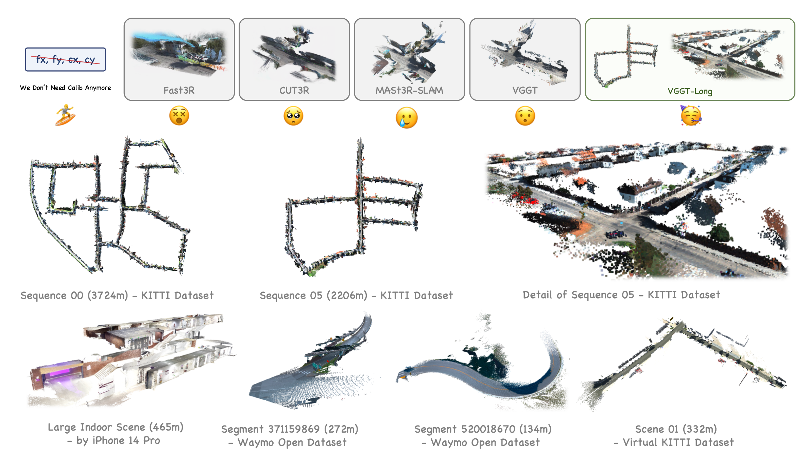
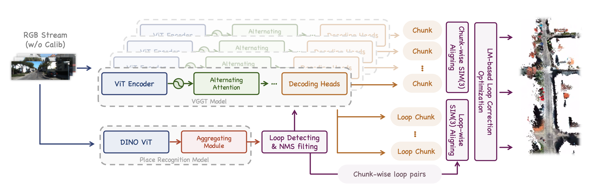
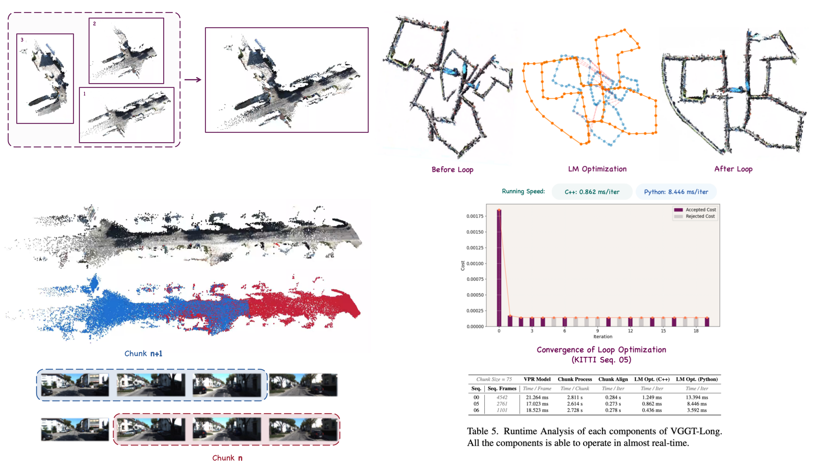
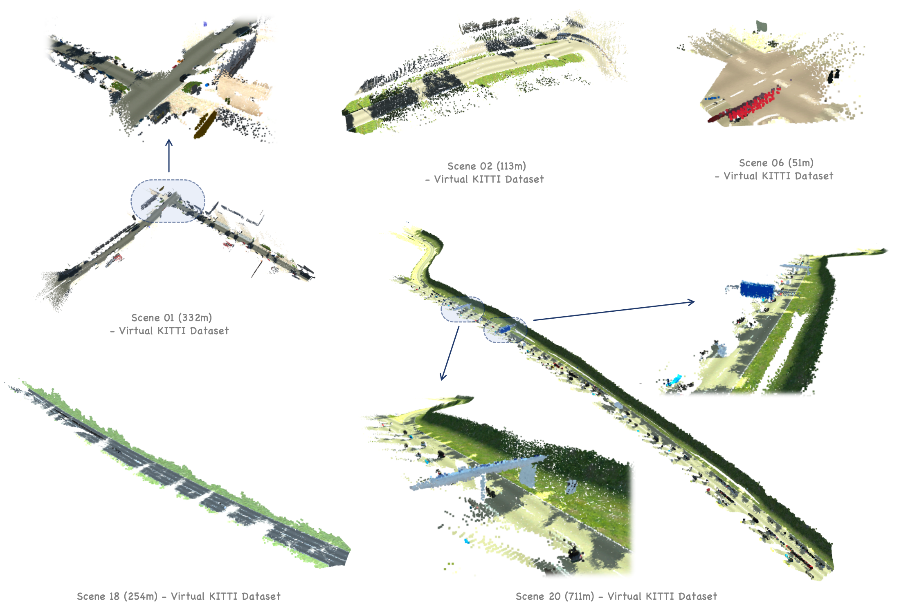
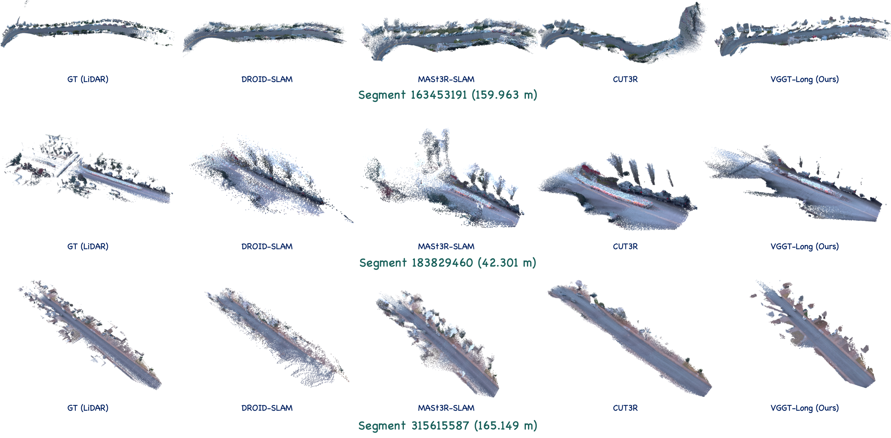
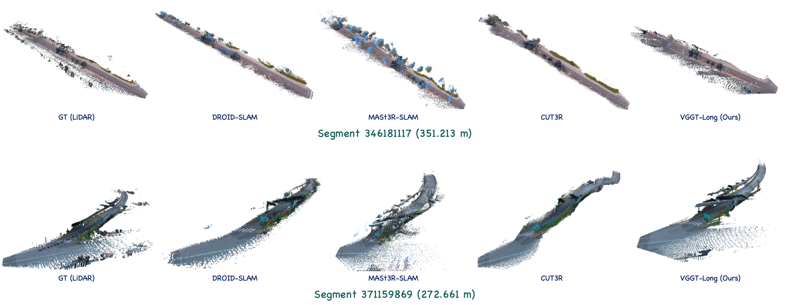
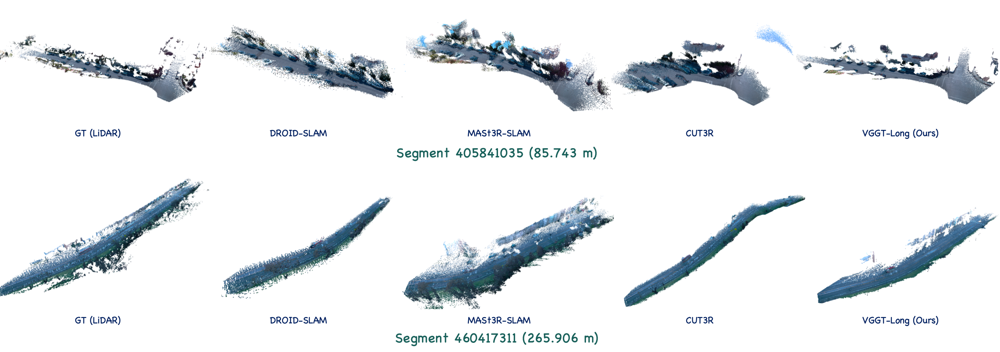
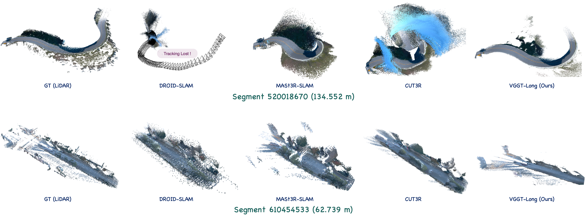

<p align="center">
<p align="center">
<h1 align="center">VGGT-Long: Chunk it, Loop it, Align it, Pushing VGGT's Limits on Kilometer-scale Long RGB Sequences</h1>
      <strong><h4 align="center"><i>Paper & Video: </i><a href="https://arxiv.org/abs/2507.16443" target="_blank">Paper</a> | <a href="http://xhslink.com/o/7p42O3mRctf" target="_blank">RedNote</a> | <a href="https://www.youtube.com/watch?v=xeRQGerAYOs" target="_blank">YouTube</a></h4></strong>
      <h4 align="center"><i>Related Repo:</i>  <a href="https://github.com/DengKaiCQ/Pi-Long" target="_blank">Pi-Long</a> | <a href="https://github.com/DengKaiCQ/Pi-Long" target="_blank">DA3-Long (Coming Soon)</a> </h4>
</p>

This repository contains the source code for our work:

[VGGT-Long: Chunk it, Loop it, Align it, Pushing VGGT's Limits on Kilometer-scale Long RGB Sequences](https://arxiv.org/abs/2507.16443)

**Abstrat:** Foundation models for 3D vision have recently demonstrated remarkable capabilities in 3D perception. However, extending these models to large-scale RGB stream 3D reconstruction remains challenging due to memory limitations. In this work, we propose **VGGT-Long**, a simple yet effective system that pushes the limits of monocular 3D reconstruction to **kilometer-scale, unbounded outdoor environments**. Our approach addresses the scalability bottlenecks of existing models through a chunk-based processing strategy combined with overlapping alignment and lightweight loop closure optimization. Without requiring camera calibration, depth supervision or model retraining, VGGT-Long achieves trajectory and reconstruction performance comparable to traditional methods. We evaluate our method on KITTI, Waymo, and Virtual KITTI datasets. VGGT-Long not only runs successfully on long RGB sequences where foundation models typically fail, but also produces accurate and consistent geometry across various conditions. Our results highlight the potential of leveraging foundation models for scalable monocular 3D scene in real-world settings, especially for autonomous driving scenarios.

https://github.com/user-attachments/assets/1eadd48d-c2b7-4927-a61a-104240121064

https://github.com/user-attachments/assets/9c338fcf-3211-4957-8fb4-1ae1c4833757

https://github.com/user-attachments/assets/c7b9872c-f4ce-4a4e-911a-6ddcf039f871





### **Updates**

`[TO BE DONE]` We are working on a feature, that is, using sparse points instead of dense points for chunk align. This way, we can achieve a way more faster alignment speed and skip DISK I/O when chunk aligning.

`[24 Nov 2025]` We accelerated the alignment process on GPU using `Triton`, resulting in a significant improvement in algorithm speed. On the `Seq. 08` (4071 frames), the new acceleration method achieved an average alignment speed of `0.009s/iter`, with a total runtime of `9 min 55 sec` (including warm-up, model loading, prediction, alignment, loop closure, disk I/O, and ply result saving). In comparison, the `numba` based method had an average alignment speed of `0.183s/iter` with a total runtime of `23 min 14 sec` (These results were tested on `A100 80 GiB` cluster). These updates will be synchronized to Pi-Long and DA3-Long.

`[16 Nov 2025]` We have updated `Scale+SE(3)` alignment. This alignment first estimates the scale at the depth level using RANSAC, then performs alignment using `SE(3)`. Since `SIM(3)` has relatively high degrees of freedom (7DoF), the scale calculated through alignment is primarily influenced by the estimated `R` and `t`. The `Scale+SE(3)` method reduces the degrees of freedom (1DoF + 6DoF) to achieve better alignment. Thanks to [@haotongl](https://github.com/haotongl) for providing this idea. We will include a complementary experiment in Arxiv v2 to test different alignment methods (including quantitative tests on Pi-Long and DA3-Long).

`[05 Nov 2025]` We have uploaded the input images captured by a mobile phone in the demo on Google Drive, as we have noticed that such complex large-scale scenes seem to be quite rare on other public datasets if you need them for your own demo. See part "Self-Collected Dataset Used in Demo Video" in `README.md`.

`[08 Oct 2025]` 1. We have updated the $\text{SE}(3)$ alignment, which you can enable in the `config.yaml` file. Recent developments in 3D models like [MapAnything](https://arxiv.org/abs/2509.13414) now support metric scale. Under such metric scale, using 6-DoF $\text{SE}(3)$ alignment will be more stable than 7-DoF $\text{SIM}(3)$ alignment. If you are using such models, we provide a code reference for $\text{SE}(3)$ alignment. 2. We have fixed a bug in the `vectorized_reservoir_sampling` function in `loop_utils/sim3utils.py`. Special thanks to [@Horace89](https://github.com/Horace89) for the assistance!

`[22 Sep 2025]` We uploaded the demo video on [RedNote](http://xhslink.com/o/7p42O3mRctf) (and we also uploaded it on [Youtube](https://www.youtube.com/watch?v=xeRQGerAYOs) later on `06 Oct 2025`). 

`[04 Sep 2025]` We have developed [Pi-Long](https://github.com/DengKaiCQ/Pi-Long) as a complementary project to `Pi3` and `VGGT-Long`. Benefiting from `Pi3`'s outstanding performance, `Pi-Long` performs even better at the kilometer scale. Feel free to check it out.

`[02 Aug 2025]` Updated the licensing terms of `VGGT-Long` to reflect the upstream dependency license (See [VGGT](https://github.com/facebookresearch/vggt) for the changes). Please see the [License Section](#license) for full details.

`[30 Jul 2025]` Chunk Align speed up (`0.273 s/iter`$\rightarrow$`0.175 s/iter` on my machine).

`[23 Jul 2025]` Fixed some bugs in `scripts/download_weights.sh`.

`[22 Jul 2025]` Arxiv submitted.

`[15 Jul 2025]` To help you better understand our project, we have updated some visualizations.

`[14 Jun 2025]` GitHub code release.

##  Setup, Installation & Running

### 🖥️ 1 - Hardware and System Environment 

This project was developed, tested, and run in the following hardware/system environment

```
Hardware Environment：
    CPU(s): Intel Xeon(R) Gold 6128 CPU @ 3.40GHz × 12
    GPU(s): NVIDIA RTX 4090 (24 GiB VRAM)
    RAM: 67.0 GiB (DDR4, 2666 MT/s)
    Disk: Dell 8TB 7200RPM HDD (SATA, Seq. Read 220 MiB/s)

System Environment：
    Linux System: Ubuntu 22.04.3 LTS
    CUDA Version: 11.8
    cuDNN Version: 9.1.0
    NVIDIA Drivers: 555.42.06
    Conda version: 23.9.0 (Miniconda)
```

### 📦 2 - Environment Setup 

> [!NOTE]
> This repository contains a significant amount of `C++` code, but our goal is to make it as out-of-the-box usable as possible for researchers, as many deep learning researchers may not be familiar with `C++` compilation. Currently, the code for `VGGT-Long` can run in a **pure Python environment**, which means you can skip all the `C++` compilation steps in the `README`.

#### Step 1: Dependency Installation

Creating a virtual environment using conda (or miniconda),

```cmd
conda create -n vggt-long python=3.10.18
conda activate vggt-long
# pip version created by conda: 25.1
```

Next, install `PyTorch`,

```cmd
pip install torch==2.2.0 torchvision==0.17.0 torchaudio==2.2.0 --index-url https://download.pytorch.org/whl/cu118
# Verified to work with CUDA 11.8 and torch 2.2.0
```

Install other requirements,

```cmd
pip install -r requirements.txt
```

#### Step 2: Weights Download

Download all the pre-trained weights needed:

```cmd
bash ./scripts/download_weights.sh
```

You can skip the next two steps if you would like to run `VGGT-Long` in pure `Python`.

#### Step 3 (Optional) : Compile Loop-Closure Correction Module

> [!NOTE]
> We provide a Python-based Sim3 solver, so `VGGT-Long` can run the loop closure correction solving without compiling `C++` code. However, we still recommend installing the `C++` solver as it is more **stable and faster**.

```cmd
python setup.py install
```

We made a simple figure (below) to help you better understanding the Sec 3.2 in paper.


#### Step 4 (Optional) : Compile `DBoW` Loop-Closure Detection Module

The VPR Model of `DBoW` is for performing VPR Model inference with CPU-only. You can skip this step.

<details>
  <summary><strong>See details</a></strong></summary>

Install the `OpenCV C++ API`.


```cmd
sudo apt-get install -y libopencv-dev
```

Install `DBoW2`

```cmd
cd DBoW2
mkdir -p build && cd build
cmake ..
make
sudo make install
cd ../..
```

Install the image retrieval

```cmd
pip install ./DPRetrieval
```

</details>

### 🚀 3 - Running the code


```cmd
python vggt_long.py --image_dir ./path_of_images
```

You can modify the parameters in the `configs/base_config.yaml` file. If you have created multiple yaml files to explore the effects of different parameters, you can specify the file path by adding `--config` to the command. For example:

```cmd
python vggt_long.py --image_dir ./path_of_images --config ./configs/base_config.yaml
```

You may run the following cmd if you got videos before `python vggt_long.py`.

```
mkdir ./extract_images
ffmpeg -i your_video.mp4 -vf "fps=5,scale=518:-1" ./extract_images/frame_%06d.png
```

### 🛠️ 4 - Possible Problems You May Encounter

You may encounter some problems. We have collected some questions and their solutions. If you encounter similar problems, you can refer to them.

<details>
  <summary><strong>See details</a></strong></summary>

#### **a. Error about `libGL.so.1`.**

The error comes from `opencv-python`, please run the following cmd to install the system dependencies.

```cmd
sudo apt-get install -y libgl1-mesa-glx
```


#### **b. Unable to install faiss-gpu (which is used in Loop Closure)**

for example,
```cmd
ERROR: Could not find a version that satisfies the requirement faiss-gpu (from versions: none)
ERROR: No matching distribution found for faiss-gpu
```


To address this issue, you can modify the `requirements.txt` file as follows:

```cmd
...
faiss-gpu -> faiss-gpu-cu11 or faiss-gpu-cu12
...
```

Then reinstall requirements:

```cmd
pip install -r requirements.txt
```

You can also find some alternative solutions at this link ([Stackoverflow](https://stackoverflow.com/questions/78200859/how-can-i-install-faiss-gpu)).


#### **c. Module `torch` has no attribute `uint64`.**

Checking [#21](https://github.com/DengKaiCQ/VGGT-Long/issues/21), you could downgrade the library `safetensors` to `0.5.3`.

#### **d. Converting to COLMAP?**

I have spent an enormous amount of time on this, but I still haven't been able to solve it at present. If you have found a solution, please submit a PR. This will be very beneficial for the entire community (I noticed that many similar repos got this problem).

#### **3. Significant drift occurred in the video we recorded with our own mobile device?**


This issue is likely caused by either minimal movement in your video or an excessively high frame rate, leading to accumulated drift. We have observed that with very dense input where movement between consecutive frames is small, the model's drift can increase to noticeable levels. You could try extracting video frames at a lower frame rate, such as `1fps` (this is similar to keyframe processing in Visual SLAM):

```cmd
ffmpeg -i your_video.mp4 -vf "fps=1,scale=518:-1" ./extract_images/frame_%06d.png
```

You may also consider switching to `Pi-Long` / `Map-Long` / `DA3-Long`, as better base models can help mitigate this issue to some extent.

Please ensure that the videos you record are free from motion blur, as the base model currently handles motion blur with limited stability.  

1. You can record at a higher frame rate, such as 60 FPS, as this reduces the exposure time per frame.  
2. Enhance stability by using a camera stabilizer or enabling the corresponding stabilization feature in the settings.  
3. Record with a wide-angle lens. In cases of similar camera shake, wide-angle lenses produce relatively less blur due to their larger field of view, which reduces the proportion of relative motion in the image.  
4. In dark environments, the camera may increase shutter time due to insufficient light, often resulting in more severe motion blur. Therefore, please ensure adequate environmental lighting while recording.  
5. If you have some photography knowledge, you can use the camera's professional mode to increase the shutter speed while also widening the aperture (decreasing the F-value) and increasing the ISO.

</details>

### 🚨 5 - Important Notice: Memory Management & Requirements

In long-sequence scenarios, addressing CPU memory and GPU memory limitations has always been a core challenge. VGGT-Long resolves **GPU** memory limitations encountered by VGGT through chunk-based input partitioning. As for **CPU** memory constraints, we achieve lower CPU memory usage by storing intermediate results on the **disk** (the consequences of CPU memory overflow are far more severe than GPU issues - while GPU OOM may simply terminate the program, **CPU OOM can cause complete system freeze**, which we absolutely want to avoid). VGGT-Long automatically retrieves locally stored intermediate results when needed. Upon completion, these temporary files are **automatically deleted** to prevent excessive disk space consumption. This implementation implies two key considerations:

1. Before running, **sufficient disk space** must be reserved (approximately 50GiB for 4500-frame KITTI 00 sequences, or ~5GiB for 300-frame short sequences);

2. The actual runtime depends on your **disk I/O speed** and **memory-disk bandwidth**, which may vary significantly across different computer systems.

## Datasets

Our test datasets are all sourced from publicly available autonomous driving datasets, and you can download them according to the official instructions.

**Waymo Open Dataset**: [Main page](https://waymo.com/open/), [V1.4.1](https://console.cloud.google.com/storage/browser/waymo_open_dataset_v_1_4_1). If you encounter any problems on Waymo, you can find the reference code at [#33](https://github.com/DengKaiCQ/VGGT-Long/issues/33) that might be helpful. We have noticed that different people seem to handle this dataset differently.

**Virtual KITTI Dataset** (V1.3.1): [Link](https://europe.naverlabs.com/research/computer-vision/proxy-virtual-worlds-vkitti-1/)

**KITTI Dataset Odometry Track**: [Link](https://www.cvlibs.net/datasets/kitti/eval_odometry.php)


## Acknowledgements

Our project is based on [VGGT](https://github.com/facebookresearch/vggt), [DPV-SLAM](https://github.com/princeton-vl/DPVO), [GigaSLAM](https://github.com/DengKaiCQ/GigaSLAM). Our work would not have been possible without these excellent repositories.

## Citation

If you find our work helpful, please consider citing:

```
@misc{deng2025vggtlongchunkitloop,
      title={VGGT-Long: Chunk it, Loop it, Align it -- Pushing VGGT's Limits on Kilometer-scale Long RGB Sequences}, 
      author={Kai Deng and Zexin Ti and Jiawei Xu and Jian Yang and Jin Xie},
      year={2025},
      eprint={2507.16443},
      archivePrefix={arXiv},
      primaryClass={cs.CV},
      url={https://arxiv.org/abs/2507.16443}, 
}
```

## License

The `VGGT-Long` codebase follows `VGGT`'s license, please refer to `./LICENSE.txt` for applicable terms. For commercial use, please follow the link [VGGT](https://github.com/facebookresearch/vggt) that should utilize the commercial version of the pre-trained weight. [Link of VGGT-1B-Commercial](https://huggingface.co/facebook/VGGT-1B-Commercial)

## Self-Collected Dataset Used in Demo Video

We have uploaded our self-collected scenes used in the demo video to Google Drive, as we found it might be difficult to find similar complex scenarios, specifically, long sequences in large scene in other datasets. We have extracted rgb frames in png format from the original videos, which you can directly read.

Initially, we intended to run the COLMAP on these scenes to provide you with a visual reference, as there is no GT after the scenes were captured. However, we found that COLMAP seems difficult to optimize in such large-scale scenario. We may update the reconstruction results from COLMAP as a visual reference later once we locate the bugs.

Download link (~13 GiB): [Google Drive](https://drive.google.com/file/d/1HGiKp94lMh0bpQHHtasFnvZUmzF2d2S1/view?usp=sharing)

COLAMP failed on my machine 🥺. If you succeed in getting it to work on these scenes with COLMAP, please contact me!

There are 4 scenes in the zip file:


## More Experiments






